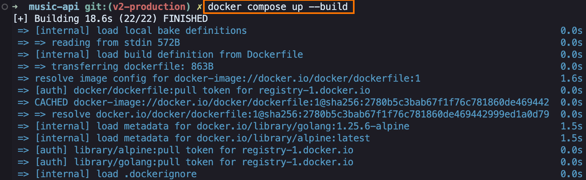
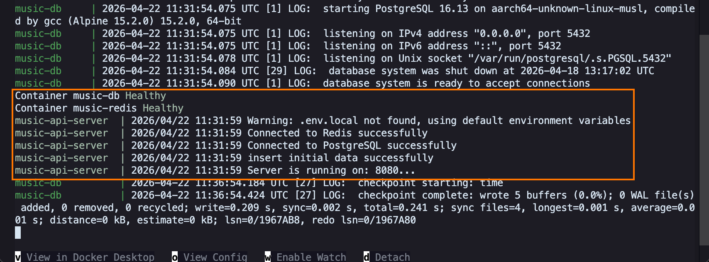
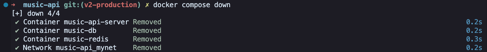
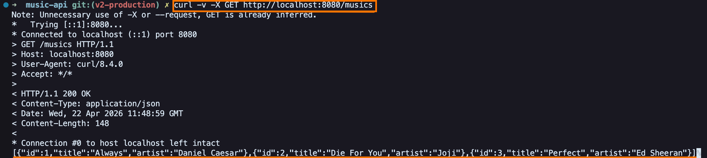

# Music API v2 - Production Ready Golang Backend

A RESTful Music API built with Go, upgraded from in-memory storage to PostgreSQL + Redis cache, and containerized with Docker.

## Tech Stack
- **Go**: Standard library only, no external frameworks
- **PostgreSQL**: Persistent storage with connection pooling
- **Redis**: Caching layer with automatic invalidation
- **Testing**: Integration tests with TestMain setup for list & get endpoints
- **Docker**: Multi-stage builds and orchestration



## Features
- GET `/musics` - List all musics with Redis caching
- POST `/musics` - Create a new music
- GET `/musics/{id}` - Get a specific music with Redis caching
- DELETE `/musics/{id}` - Delete a music
- PUT `/musics/{id}` - Update a music
## Prerequisites

**For Local Development**
- PostgreSQL running on localhost:5432
- Redis running on localhost:6379
- Go installed (any recent version)
- Docker Desktop running (for database setup)

## How to Run

**Local Development**
``` bash
# Start database first
docker compose up -d db redis

# Then run the app
go run ./cmd/app/main.go
```
**Docker Development**
``` bash
docker compose up --build
```





### Stop Containers
Clean shutdown of all services (API, PostgreSQL, Redis).


``` bash
docker compose down
```


## How to Test
**Testing**
``` bash
go test -v ./test/
```

## API Examples
``` bash
# Get all musics
curl -v -X GET http://localhost:8080/musics

# Get specified music
curl -v -X GET http://localhost:8080/musics/2

# Create a new music
curl -v -X POST -H "Content-Type: application/json" \
    -d '{"title":"Blinding Lights","artist":"The Weekend"}' \
    http://localhost:8080/musics

# Delete a music
curl -v -X DELETE http://localhost:8080/musics/3
```

Example of `GET`:


## Learning Points
- Built full **CRUD** operations with **PostgreSQL**
- Implemented **Redis cache** with invalidation
- Handled **JSON** encoding/decoding and proper **HTTP status codes**
- Practiced **TDD** and wrote integration tests with `httptest`
- Conquered **Docker orchestration** - overcame complex setup challenges to achieve true cross-platform deployment