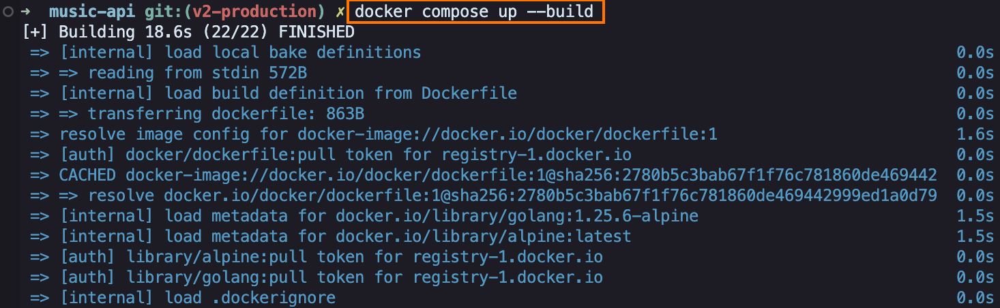
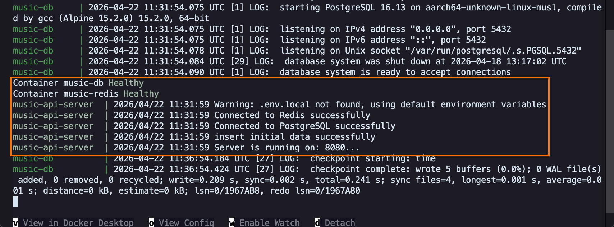
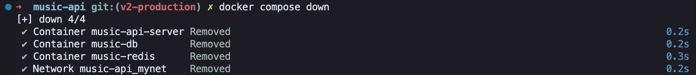
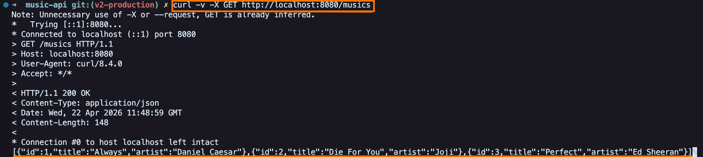

# Music API v2 - Production Ready Golang Backend

A RESTful Music API built with Go, upgraded from in-memory storage to PostgreSQL + Redis cache, and containerized with Docker.

## Tech Stack
- **Go**: Standard library only, no external frameworks
- **PostgreSQL**: Persistent storage with connection pooling
- **Redis**: Caching layer with automatic invalidation
- **Testing**: Integration tests with TestMain setup for list & get endpoints
- **Docker**: Multi-stage builds and orchestration

<!--  -->


## Cache Performance Benchmark

### Test Environment

| | |
|---|---|
| Machine | MacBook Air (Mac15,13) |
| Chip | Apple M3 — 8 cores (4 performance + 4 efficiency) |
| Memory | 24 GB unified memory |
| OS | macOS 14.4.1 |
| Go | go1.25.6 darwin/arm64 |
| Load generator | Apache Bench (ab) 2.3 |
| DB / Cache | PostgreSQL 16-alpine, Redis alpine (Docker containers, same host) |

Client (`ab`), API server, PostgreSQL and Redis all ran on the same machine — no network latency between components. Numbers reflect this single-host setup, not a distributed deployment.

### Methodology

Two separate benchmarks answer two separate questions:

1. **With Redis vs without Redis** — is adding a caching layer in front of Postgres worth it at all? Tested by toggling a `CACHE_ENABLED` flag: when off, `GET /musics/:id` always queries Postgres directly, bypassing Redis entirely.
2. **Cold vs warm cache** — once Redis is in the architecture, how much does cache hit rate matter? Tested by flushing Redis (`FLUSHALL`) immediately before the "cold" run, then re-running the identical load immediately after (Redis already populated) for "warm".

Each scenario: `ab -n 1000 -c 50 http://localhost:8080/musics/1`.

| | No Redis (direct Postgres) | Redis — cold | Redis — warm |
|---|---|---|---|
| Mean response time | 29.2 ms | 6.3 ms | 3.9 ms |
| Requests per second | 1,713 req/s | 7,923 req/s | 12,938 req/s |
| App process CPU (peak / avg, sampled during a 5s sustained load) | 108.1% / 32.1% | 5.8% / 0.9% | 5.8% / 0.9% |
| App process memory (RSS, steady-state) | ~13 MB | ~17 MB | ~17 MB |

**Result:**
- **Adding Redis** (even measured on a batch that includes the cache-miss requests) cuts mean response time by ~78% and gives ~4.6x throughput versus hitting Postgres directly, while using roughly 20x less CPU per request — most of Postgres's cost is query planning/execution, not present on a Redis `GET`.
- **Once warm**, Redis is a further ~1.6x faster than the cold-start batch (3.9 ms vs 6.3 ms), because the cold batch's overall average is still dragged down by the small number of true cache-miss requests at the very start.

Note: CPU/memory were sampled from a separate 5-second sustained-load run (`ab -t 5 -c 50`) rather than the 1,000-request runs above, since `top`'s 1-second sampling interval needs a longer window to produce a meaningful reading. Cold and warm show the same resource profile because, over a sustained window, the vast majority of requests are cache hits either way — the CPU/memory difference that matters is Redis-path vs Postgres-path, not cold-vs-warm.

## Features
- GET `/musics` - List all musics with Redis caching
- POST `/musics` - Create a new music
- GET `/musics/{id}` - Get a specific music with Redis caching
- DELETE `/musics/{id}` - Delete a music
- PUT `/musics/{id}` - Update a music
## Prerequisites

**For Local Development**
- PostgreSQL running on localhost:5432
- Redis running on localhost:6379
- Go installed (any recent version)
- Docker Desktop running (for database setup)

## How to Run

**Local Development**
``` bash
# Start database first
docker compose up -d db redis

# Then run the app
go run ./cmd/app/main.go
```
**Docker Development**
``` bash
docker compose up --build
```





### Stop Containers
Clean shutdown of all services (API, PostgreSQL, Redis).


``` bash
docker compose down
```


## How to Test
**Testing**
``` bash
# Start required services first
docker compose up -d db redis
 
# Then run tests
go test -v ./test/
```

## API Examples
``` bash
# Get all musics
curl -v -X GET http://localhost:8080/musics

# Get specified music
curl -v -X GET http://localhost:8080/musics/2

# Create a new music
curl -v -X POST -H "Content-Type: application/json" \
    -d '{"title":"Blinding Lights","artist":"The Weekend"}' \
    http://localhost:8080/musics

# Delete a music
curl -v -X DELETE http://localhost:8080/musics/3
```

Example of `GET`:
