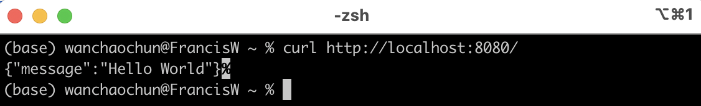

# Simple Web Server in Go

A simple HTTP server built with Go using only the standard library (`net/http`).


## Features
- GET `/` → returns JSON `{"message":"Hello World"}` with correct `Content-Type`
- GET `/greet/{name}` → returns "Hi, {name}!"


## How to run
```bash
go run .
```

## How to test
```bash
go test -v
curl http://localhost:8080/
```


---

# Learning points
- Practiced **Test-Driven Development(TDD)** with `httptest`
- Used `http.NewServeMux()` for routing
- Handled dynamic URL path with `strings.TrimPrefix`
- Used `encoding/json` + `Content-Type` header to return proper JSON API

