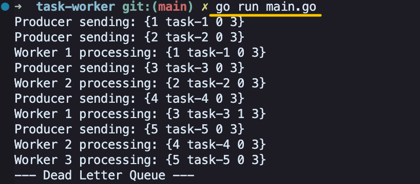
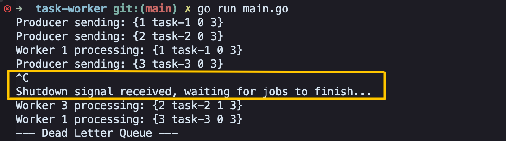

# task-worker

A concurrent task worker system built with Go that processes jobs asynchronously with retry handling, dead-letter queue support, and scalable worker pool architecture.

## Overview

This project simulates a real-world backend job processing system where a producer continuously generates tasks, a pool of workers processes them concurrently, failed jobs are automatically retried, and jobs that exceed the retry limit are isolated in a dead-letter queue.


## Features

- **Worker Pool** — fixed number of goroutines concurrently consuming jobs from a shared channel
- **Retry mechanism** — failed jobs are automatically re-enqueued with an incremented retry counter
- **Dead Letter Queue (DLQ)** — jobs that exceed `MaxRetries` are isolated for inspection
- **Graceful shutdown** — listens for `SIGINT` / `SIGTERM`; stops the producer and waits for in-flight jobs to finish before exiting
- **Dependency injection** — `ShouldFail` func is injected into each worker, making failure behavior controllable and testable

## Project structure

```
task-worker/
├── main.go               # entry point: wires producer, worker pool, shutdown
├── queue/
│   ├── queue.go          # Job struct, Queue with Enqueue / Dequeue
│   └── queue_test.go     # FIFO ordering, enqueue/dequeue correctness
├── worker/
│   ├── worker.go         # Worker, StartPool, ProcessJob
│   └── worker_test.go    # retry re-enqueue, DLQ routing
└── producer/
    └── producer.go       # Producer with context-aware job generation
```

## Getting started

**Run normally**
```bash
go run main.go
```


**Test graceful shutdown** — start the program, then press `Ctrl+C` while it is running. The producer stops immediately; workers finish processing jobs already in the queue before the program exits.


**Run tests**
```bash
go test -v ./...
```

**Run tests with race detector**
```bash
go test -race ./...
```

## Configuration

The following values can be adjusted directly in `main.go` and `worker/worker.go`:

| Parameter | Location | Default | Description |
|-----------|----------|---------|-------------|
| `JobCount` | `main.go` | `5` | Number of jobs the producer generates |
| `numWorkers` | `main.go` | `3` | Number of concurrent workers |
| `MaxRetries` | `producer.go` | `3` | Maximum retry attempts per job |
| `ShouldFail` | `worker.go` | 30% chance | Failure rate simulation |
| Queue size | `main.go` | `10` | Buffered channel capacity |

## Key design decisions

**Why `context` for shutdown?**
`context.WithCancel` lets the producer check for a cancellation signal between job submissions without polling or adding complexity to the main loop. When `cancel()` is called, the producer's `select` unblocks and returns cleanly.

**Why track job count with `sync.WaitGroup` instead of worker count?**
Workers are long-running goroutines — they only exit when the channel closes. Tracking the number of jobs (not workers) lets `main` know when all work is actually done, which is the correct signal to close the channel and print the DLQ.

**Why inject `ShouldFail` as a function?**
Hard-coding `rand.IntN(10) < 3` inside the worker makes the failure behavior untestable. Injecting the function lets tests pass `func() bool { return true }` to force deterministic failures without changing any production logic.

## Tech Stack

- **Language**: Go
- **Concurrency**: goroutine, channel, `sync.WaitGroup`
- **Cancellation**: `context.WithCancel`
- **Shutdown**: `os/signal`, `syscall.SIGINT`, `syscall.SIGTERM`
- **Testing**: Go standard `testing` package, race detector (`-race`)